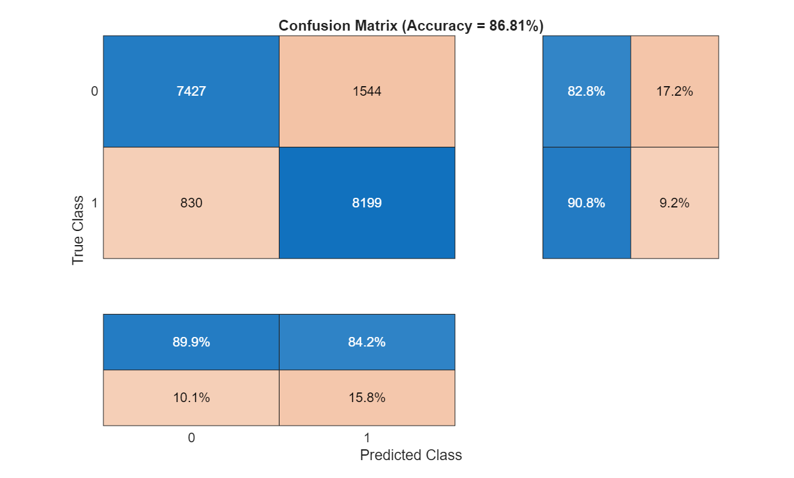
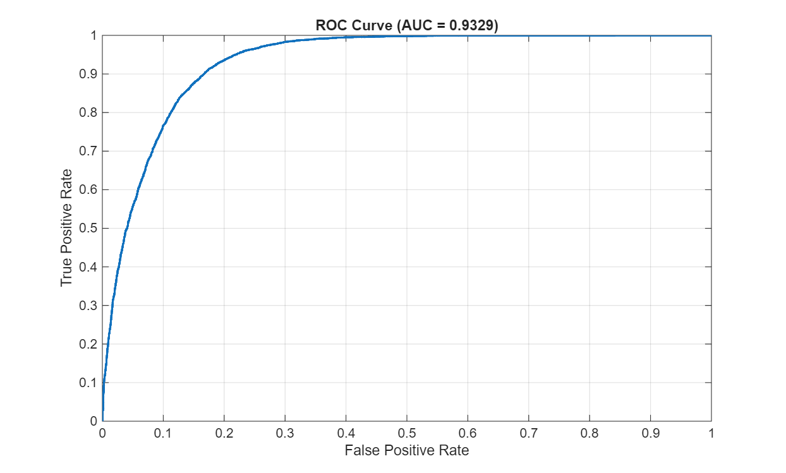
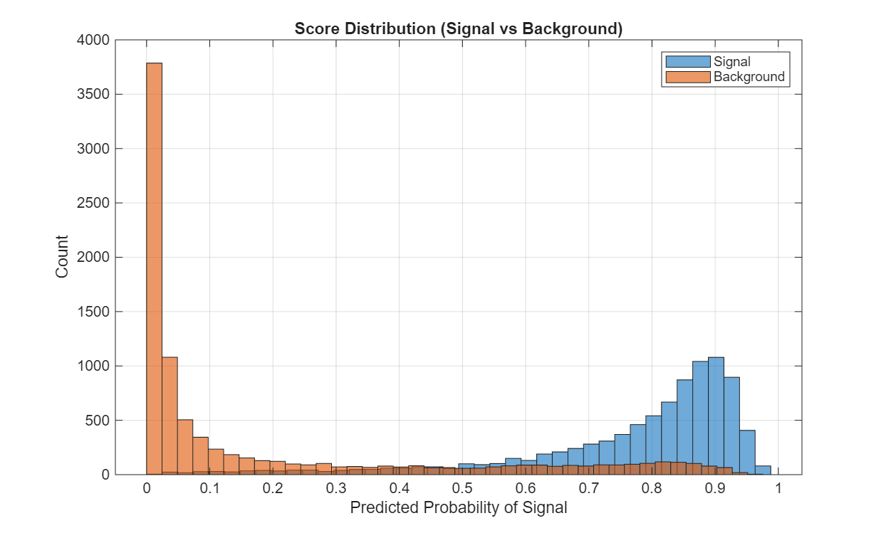
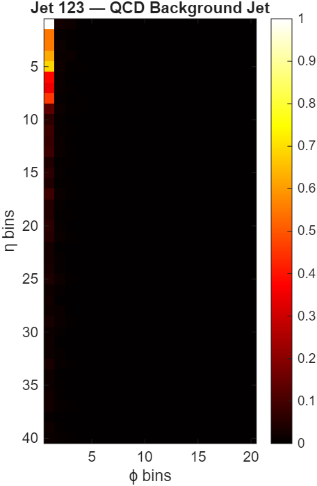
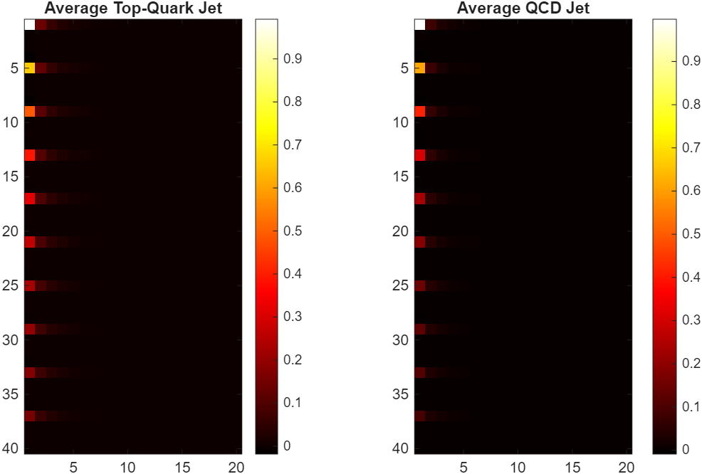
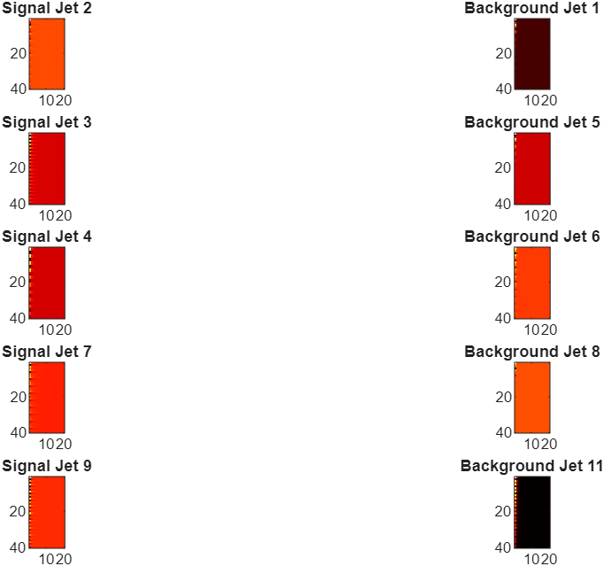

# Lightweight Top-Quark Jet Classification with Deep Learning

This project explores how deep learning can be used to identify hadronically decaying top quarks from low-level detector-like data.
Using a compact jet-image representation and a lightweight CNN, the model learns to distinguish Top-Quark jets from QCD background jets, achieving:
- Validation Accuracy: ~86.8%
- ROC AUC: ~0.93
- CPU-friendly training (≤16 GB RAM)

The project was developed as part of my exploration into collider physics and jet substructure, with an emphasis on clarity, reproducibility, and physical interpretability.

## 1. Physics Background

In proton–proton collisions at high energy (e.g., at the LHC), the top quark decays almost instantly. When it decays hadronically, the decay chain: 

```t → Wb → q q̄′ b```


produces three quarks within a narrow angular region. After hadronisation, these quarks manifest as three localized energy branches inside a single jet.

Why this matters:

- The three-prong substructure is a key signature of boosted top quarks.

- Standard QCD jets (from quarks/gluons) typically exhibit a single dominant core.

The ability to tell these jets apart is crucial in many LHC analyses involving:

- top-quark physics
- new physics searches
- boosted-object tagging pipelines
- trigger-level event selection

Why use jet images?

Calorimeters at ATLAS/CMS record energy deposits in discrete towers.
Projecting these towers into an η–ϕ grid forms a 2D “image”:

- η (pseudorapidity) → vertical axis
- ϕ (azimuth) → horizontal axis
- Pixel intensity → energy from particles falling in that tower

This project reshapes raw per-particle 4-momentum data into a 40×20 calorimeter-like image for each jet.

Even though this representation is simplified, it still captures:

- energy concentration
- jet width
- multi-prong patterns
- local substructure

These are precisely the features that CNNs excel at learning.

## 2. Dataset

Each jet contains up to 200 particles, each described by their four-momentum components:

``` E, px, py, pz```

These 800 values are reshaped into a 40×20 grid, then normalized per jet.

A separate Python snippet (optional) can be used to create a .parquet file:
```
import pandas as pd

df = pd.read_hdf("train.h5", "table").sample(n=90000)
df.to_parquet("jets90000.parquet.gzip", compression="gzip")
```
MATLAB scripts convert this into jet images and create train/validation splits.

## 3. CNN Architecture

A compact CNN was chosen to balance physics performance with computational constraints (CPU-only training).

Architecture 
```
┌──────────────────────┐      ┌────────────────────────┐     ┌──────────────────────┐
│    Data Pipeline     │────▶ │   Jet Image Builder    │────▶│    CNN Classifier   │
│                      │      │                        │     │                      │
│ • 4-Momentum Input   │      │ • 40×20 Grid Mapping   │     │ • Conv5×5 (32)       │
│ • Normalization      │      │ • Energy Projection    │     │ • Conv3×3 (64)       │
│ • Train/Val Split    │      │ • Per-Jet Scaling      │     │ • Conv3×3 (128)      │
└──────────────────────┘      └────────────────────────┘     │ • FC(128) + Dropout  │
             │                         │                     │ • Softmax (Top/QCD)  │
             ▼                         ▼                     └───────────┬──────────┘
      ┌────────────────┐      ┌────────────────────────┐                 │
      │ Visualization  │◀────│     Evaluation Tools   │─────────────────┘
      │                │      │                        │
      │ • Jet Images   │      │ • ROC / AUC            │
      │ • Avg Heatmaps │      │ • Confusion Matrix     │
      │ • Comparisons  │      │ • Score Distribution   │
      └────────────────┘      └────────────────────────┘
```
Why this architecture?

It is small enough to avoid overfitting given simple jet images.
It retains multi-scale feature extraction, suitable for:
- jet width
- local energy clusters
- three-prong vs one-prong structure
It trains reliably on CPU while reaching AUC ≈ 0.93, which is very competitive for single-channel jet images.

## 4. Evaluation Results
- Graphs
### Confusion Matrix

### ROC Curve


AUC ≈ 0.93, indicating strong separation between top-quark and QCD jets.
This level of performance is typical of well-designed CNN-based jet taggers applied to single-channel calorimeter images.

### Score Distribution


Signal and background form two well-separated peaks—evidence that the network learned meaningful substructure differences.

## 5. Jet Image Visualizations

The project includes visualization tools that helped me understand the physics behind the classification.

- Single Jet Visualization
Shows the sparse, tower-like nature of jet images.

```visualize_jets("single", 120);```



- Average Signal vs Background
  
These plots visualize the “typical” top jet compared to a typical QCD jet.

```visualize_jets("average");```




- Side-by-Side Comparisons
  
```visualize_jets("compare", 5);```



Even in simple grayscale images, subtle structural differences appear:
- Top jets are broader and more distributed.
- QCD jets tend to be more sharply centered.

These qualitative patterns match expectations from jet-substructure physics.

# 6. Folder Structure
```
quark_detection/
│
├── data/
│   ├── jets90000.parquet.gzip        # Raw → processed dataset
│   ├── cnn_v1_data.mat               # Train/val data
│   └── cnn_v1_eval.mat               # Evaluation outputs
│
├── model/
│   └── cnn_model.mat                 # Final trained CNN model
│
├── results/
│   ├── v1_confusion_matrix.png
│   ├── v1_roc_curve.png
│   ├── v1_score_distribution.png
│   ├── jet123.png
│   ├── avg_quark.png
│   └── sig_vs_back.png
│
├── scripts/
│   ├── cnn_v1_data.m
│   ├── cnn_v1_split.m
│   ├── cnn_v1_eval.m
│   └── visualize_jets.m
│
└── README.md


```
## 7. Running the Project

- Step 1 — Convert data to jet images  
```run scripts/cnn_v1_data.m```

- Step 2 — Train the CNN  
```run scripts/cnn_v1_split.m```

- Step 3 — Evaluate the model  
```run scripts/cnn_v1_eval.m```

- Step 4 — Visualize jets  
```visualize_jets("single", 50);```

## 8. Summary and Outlook

This project demonstrates that:
- Even simple jet images contain enough information to identify boosted top quarks.
- A compact CNN can reach AUC ≈ 0.93 without large architectures or engineered physics features.

Lightweight approaches remain relevant for:

- CPU-only environments
- educational and research prototypes
- rapid benchmarking
- trigger-level feasibility studies

Further extensions could include:

- multi-channel jet images (pT, eta, phi, energy)
- physics-derived features such as n-subjettiness
- residual or attention-based architectures
- saliency maps for interpretability
- comparison against more modern taggers (e.g., ParticleNet)
