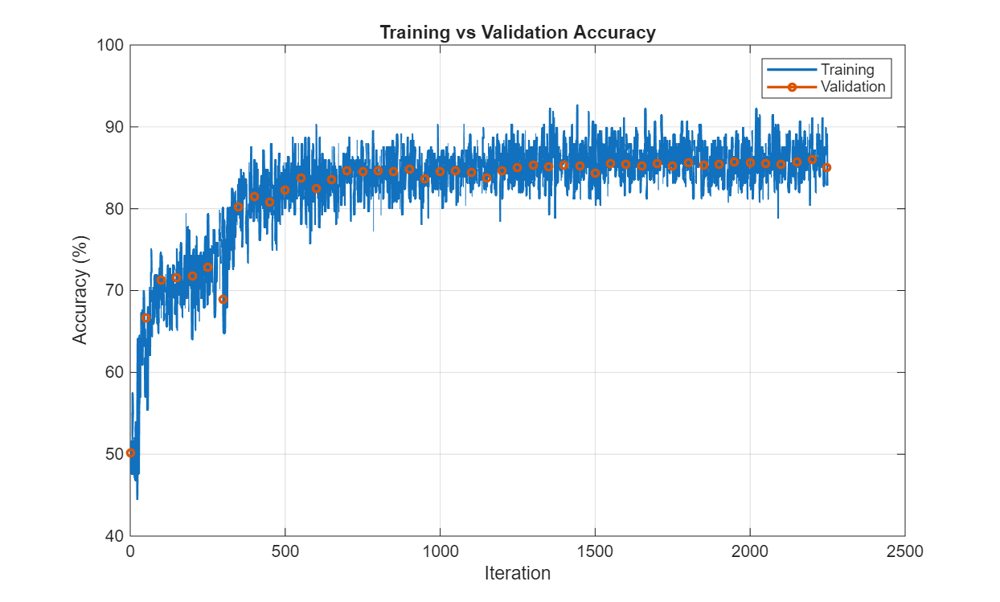
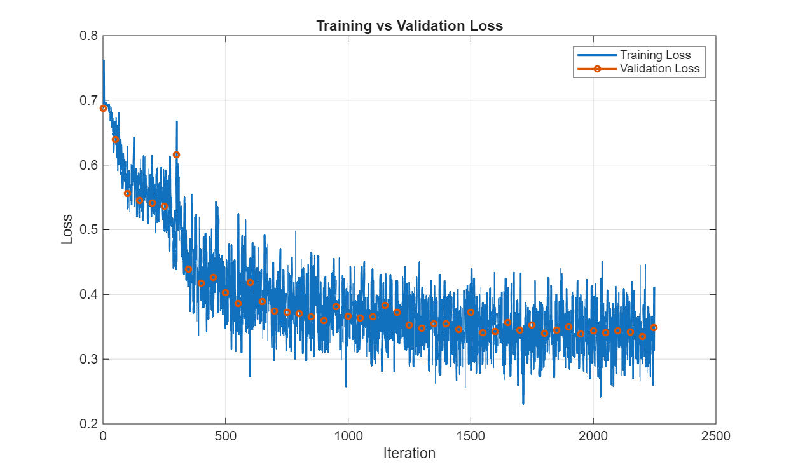
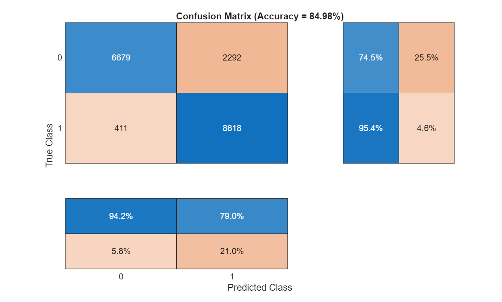
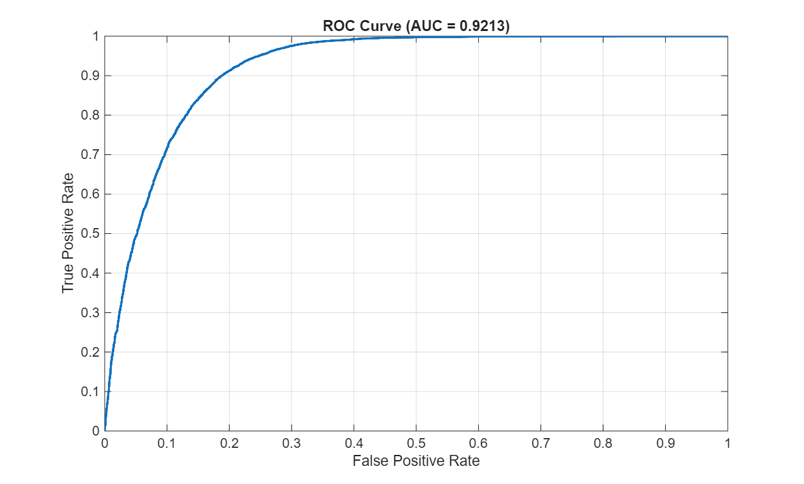
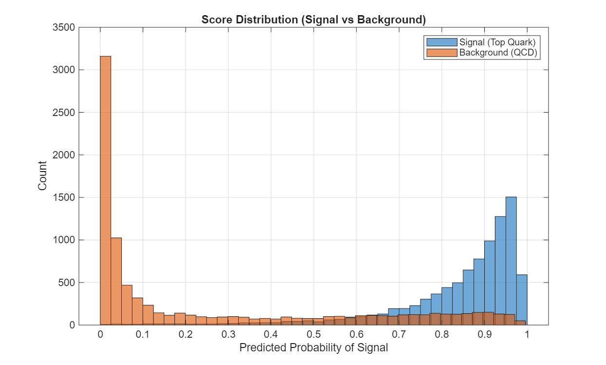
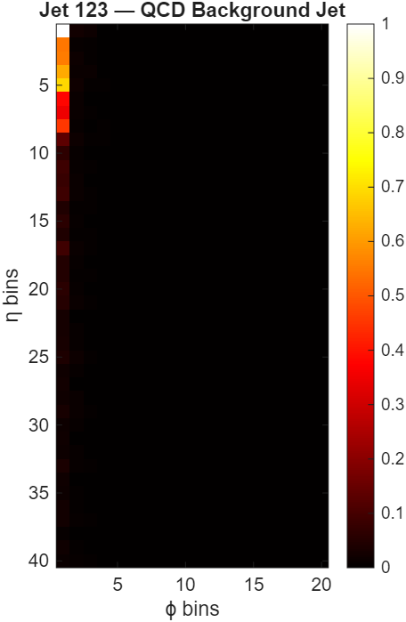
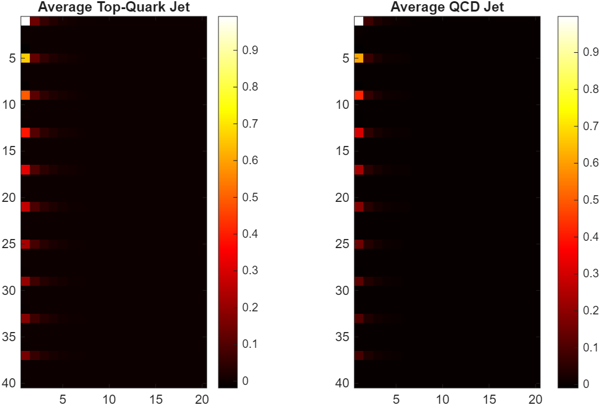
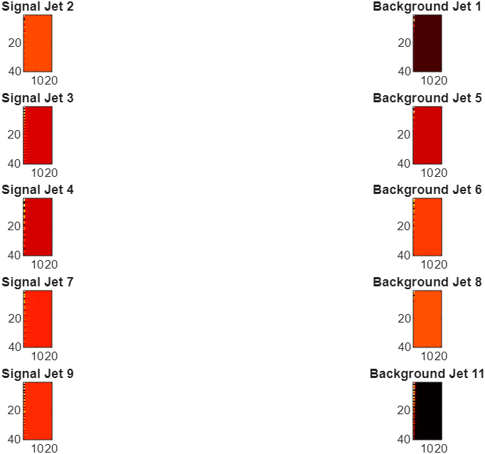

# Lightweight Top-Quark Jet Classification with Deep Learning

This project explores how deep learning can be used to identify hadronically decaying top quarks from low-level detector-like data. Using a compact jet-image representation and a lightweight CNN, the model learns to distinguish Top-Quark jets from QCD background jets, achieving:

- Validation Accuracy: ~84.98%
- ROC AUC: ~0.92
- CPU-friendly training (≤16 GB RAM)

## 1. Physics Background

In high-energy proton–proton collisions (e.g., at the LHC), a hadronically decaying top quark follows:

`t → Wb → q q̄′ b`

The resulting three quarks appear as a **three-prong energy pattern** inside a single, boosted jet.  
Standard QCD jets, by contrast, typically show only **one dominant core**.

These structural differences are important for analyses involving boosted-object tagging, new-physics searches, and trigger-level selections. To capture this substructure, raw particle 4-momentum is projected onto a **40×20 η–ϕ grid**, forming a calorimeter-like jet image. Even this simplified representation preserves energy concentration, jet width, and multi-prong patterns—features that CNNs learn effectively.

## 2. Dataset

This project uses the open jet dataset from CERN (Zenodo):  
https://zenodo.org/records/2603256

Each jet has up to 200 particles, stored as four-momentum values:

`E, px, py, pz`

(Zero-padded if fewer than 200 constituents.)

A preprocessed sample of 90k jets used in this project is available here:  
**Google Drive:** https://drive.google.com/file/d/1ISTa0HIJZT8hH_Zf0tRVVoHQ5Ci1QJmK/view?usp=sharing

To create the Parquet file yourself:

```python
import pandas as pd

df = pd.read_hdf("train.h5", "table").sample(n=90000)
df.to_parquet("data/jets90000.parquet.gzip", compression="gzip")
```

## 3. CNN Architecture

A compact CNN was chosen to balance physics performance with computational constraints (CPU-only training). Data is loaded using MATLAB's `parquetDatastore` and preprocessed via `tall` arrays before training, using MATLAB’s parquetDatastore and tall arrays to establish a scalable data pipeline, with in-memory processing used here for the 90k sample subset.

```
┌──────────────────────┐      ┌────────────────────────┐     ┌──────────────────────┐
│    Data Pipeline     │────▶ │   Jet Image Builder    │────▶│    CNN Classifier   │
│                      │      │                        │     │                      │
│ • parquetDatastore   │      │ • 40×20 Grid Mapping   │     │ • Conv5×5 (32)       │
│ • tall Array Preproc │      │ • Energy Projection    │     │ • Conv3×3 (64)       │
│ • Train/Val Split    │      │ • Per-Jet Scaling      │     │ • Conv3×3 (128)      │
└──────────────────────┘      └────────────────────────┘     │ • FC(128) + Dropout  │
             │                         │                     │ • Softmax (Top/QCD)  │
             ▼                         ▼                     └───────────┬──────────┘
      ┌────────────────┐      ┌────────────────────────┐                 │
      │ Visualization  │◀────│     Evaluation Tools   │─────────────────┘
      │                │      │                        │
      │ • Jet Images   │      │ • ROC / AUC            │
      │ • Avg Heatmaps │      │ • Confusion Matrix     │
      │ • Comparisons  │      │ • Score Distribution   │
      └────────────────┘      └────────────────────────┘
```

Key hyperparameters:

| **HYPERPARAMETER**     | **VALUE** | **DESCRIPTION**                             |
|------------------------|-----------|---------------------------------------------|
| Initial Learn Rate     | 5e-3      | Reduces risk of overshooting the optimum    |
| Learn Rate Schedule    | Piecewise | Simple and stable decay strategy            |
| Learn Rate Decay       | 0.3       | Multiplies LR by 0.3 at each drop step      |
| Learn Rate Drop Period | 4 epochs  | Decays LR every 4 epochs                    |
| L2 Regularization      | 1e-4      | Light penalty to control overfitting        |
| Batch Size             | 256       | Balanced between training speed and RAM use |
| Max Epochs             | 8         | Model begins to overfit past ~14 epochs     |
| Optimizer              | Adam      | Stable and adaptive for small CNNs          |

## 4. Evaluation Results

Achieved 84.98% validation accuracy and AUC ≈ 0.92 using 90k training samples.

### Training Curves

<p align="center">

</p>

<p align="center">

</p>

### Confusion Matrix

<p align="center">

</p>

### ROC Curve

<p align="center">

</p>

### Score Distribution

<p align="center">

</p>

## 5. Jet Image Visualizations

The project includes visualization tools that helped understand the physics behind the classification:

### Single Jet Visualization: A single jet image showing the sparse, tower-like energy pattern.

<p align="center">

</p>

### Signal vs Background: Average jet images highlighting structural differences between top and QCD jets.

<p align="center">

</p>

### Side-by-Side Comparisons: Direct comparison of individual signal and background jets.

<p align="center">

</p>

## 6. Folder Structure

```
top-quark-detection/
│
├── data/
│   ├── jets90000.parquet.gzip        # refer to gdrive link above
│   ├── cnn_v1_data.mat               # train/val image arrays
│   ├── cnn_v1_split.mat              # training info (loss/accuracy curves)
│   └── cnn_v1_eval.mat               # evaluation outputs (predictions, scores)
│
├── model/
│   └── cnn_model.mat                 # final trained cnn
│
├── results/
│   ├── v1_training_accuracy.png
│   ├── v1_training_loss.png
│   ├── v1_confusion_matrix.png
│   ├── v1_roc_curve.png
│   ├── v1_score_distribution.png
│   ├── jet123.png
│   ├── avg_quark.png
│   └── sig_vs_back.png
│
├── scripts/
│   ├── cnn.m
│   ├── evaluatem.m
│   └── visualize_jets.m
│
└── README.md
```

## 7. Running the Project

**Step 1 — Generate the parquet file from raw CERN data (Python, run once)**

Download `train.h5` from the Zenodo link above, then run:

```python
import pandas as pd

df = pd.read_hdf("train.h5", "table").sample(n=90000)
df.to_parquet("data/jets90000.parquet.gzip", compression="gzip")
```

**Step 2 — Train the CNN**

```matlab
run scripts/cnn.m
```

This loads data via `parquetDatastore` and `tall` arrays, builds jet images, trains the network, and saves all outputs to `data/` and `model/`.

**Step 3 — Evaluate the model**

```matlab
run scripts/evaluatem.m
```

Generates all plots (confusion matrix, ROC curve, score distribution, training curves) and saves them to `results/`.

**Step 4 — Visualize jets**

```matlab
addpath scripts
visualize_jets("single", 50)      % single jet by index
visualize_jets("average")         % mean image: signal vs background
visualize_jets("compare", 3)      % 3 side-by-side pairs
```

## 8. Conclusion

This project demonstrates that meaningful jet substructure discrimination can be achieved using a lightweight deep learning approach that is accessible beyond large computing clusters. Data is handled using MATLAB's `parquetDatastore` and `tall` array workflow, enabling the pipeline to scale to datasets far larger than available RAM. By operating on compact jet-image representations and a small convolutional neural network, the model achieves strong signal–background separation while remaining feasible to train on a standard laptop.

In addition to classification performance, the accompanying visualizations highlight the physically interpretable features learned by the network, such as the characteristic multi-prong structure of hadronically decaying top-quark jets. This combination of scalable data handling, computational efficiency, interpretability, and competitive performance makes the approach suitable for exploratory studies, education, and rapid prototyping in high-energy physics analyses.
